# 💰 땡그랑 (초등 경제 교육 서비스)

### 👆 위 이미지 클릭하면 `앱 소개 영상` 감상 가능합니다 👆

 

## 목차

1. [**개요**](#✨-개요)
1. [**주요 기능**](#-주요-기능)
1. [**서비스 화면 (교사 / 학생)**](#-땡그랑-서비스-화면-교사)
1. [**기술 스택**](#-기술-스택)
1. [**프로젝트 진행 및 산출물**](#-프로젝트-진행-및-산출물)
1. [**개발 멤버 및 회고**](#-개발-멤버-및-역할분담)
1. [**메뉴얼 및 상세문서**](#-메뉴얼-및-상세-문서)

 

## ✨ 개요

#### 서비스명 : 땡그랑 ( 똑똑한 경제 학습 )

#### 한줄 설명 : `디지털 교과서 전환에 맞춘, 테블릿 활용 초등 경제 학습 서비스`

#### 프로젝트 기간 : 2025.01.06 ~ 2025.02.21

## ✨ 프로젝트 소개
초등학교 교사 대상 **설문조사**를 통해,  
**경제 교육을 운영하는 데 있어 반복되는 수작업과 업무 부담**이 크다는 문제를 확인했습니다.

- 가상월급 수기 작성
- 소비·저축 내역 정리
- 체계 없는 활동 관리…

이러한 현실적인 어려움을 해결하고자,  
**학생은 재미있게 경제 활동을 체험하고,**  
**교사는 효율적으로 수업을 운영할 수 있는 앱**을 기획했습니다.

**📱 앱 기반 경제 시스템 + AI 피드백 + 소비 성향 분석 기능**을 통해  
아이들의 **경제적 사고력**을 키우고,  
교사의 **업무 부담을 덜어주는 스마트 교육 솔루션**을 제안합니다.

> 🖥️ 관련 시뮬레이션 영상 보기  
https://www.youtube.com/watch?v=8hMvV-DCEGs

> 📋 설문조사 보러가기
https://docs.google.com/forms/d/e/1FAIpQLSf5vMFO_IOTUT6wK1CLP8ovAmwIx8pirnQvcQQzFWcYqllL6g/viewform

 

## ✨ 기획 배경
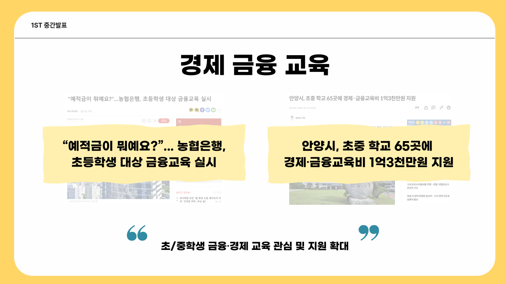

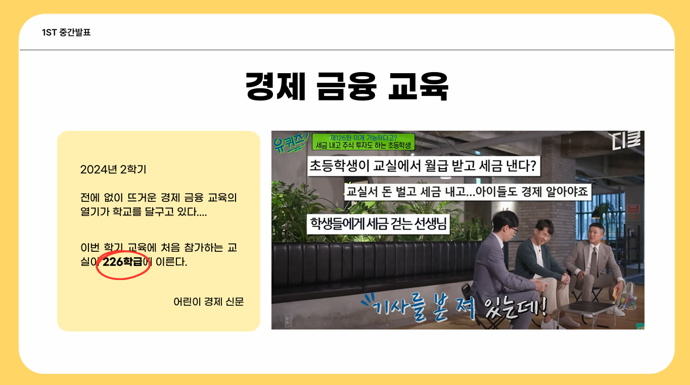

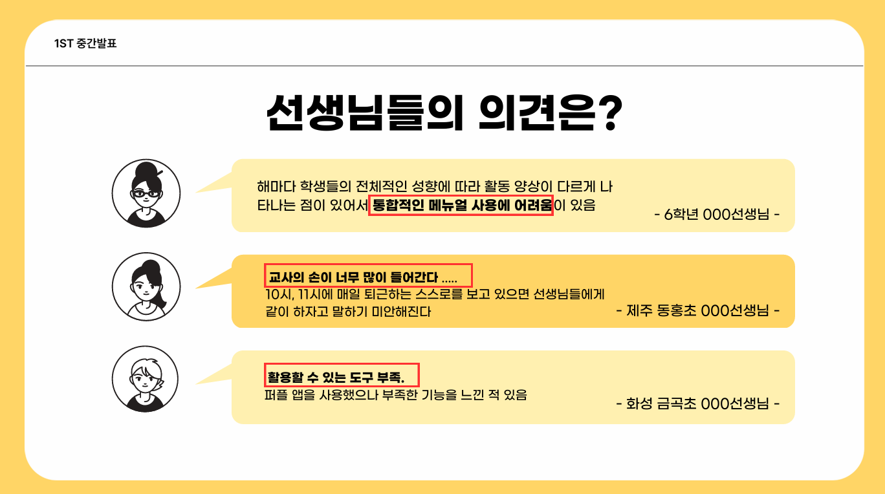

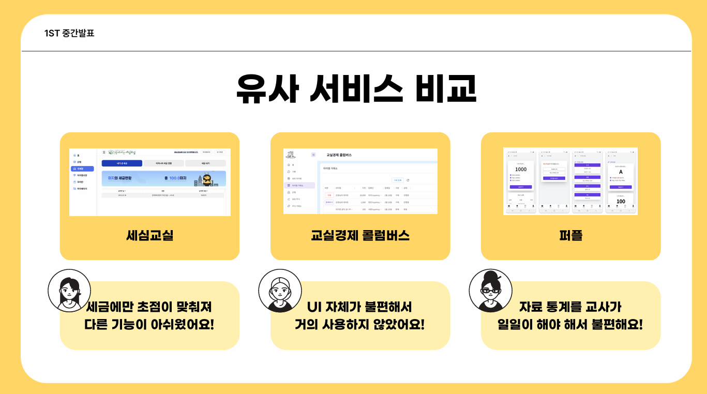

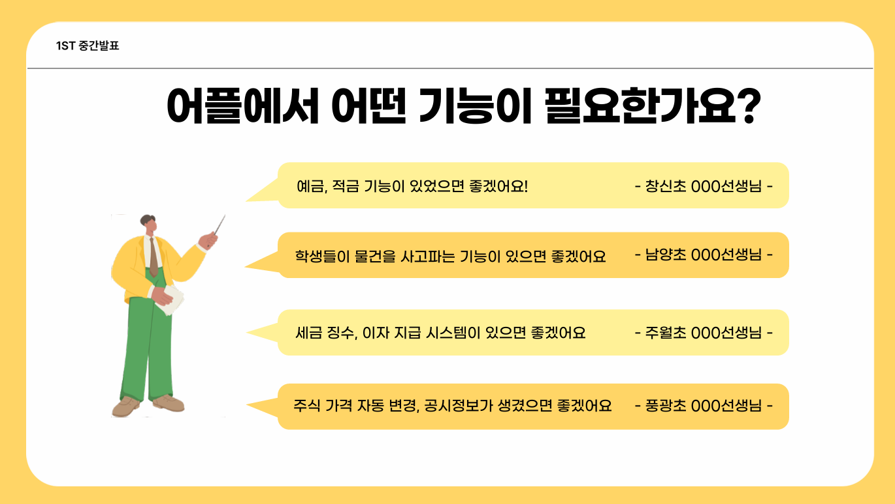

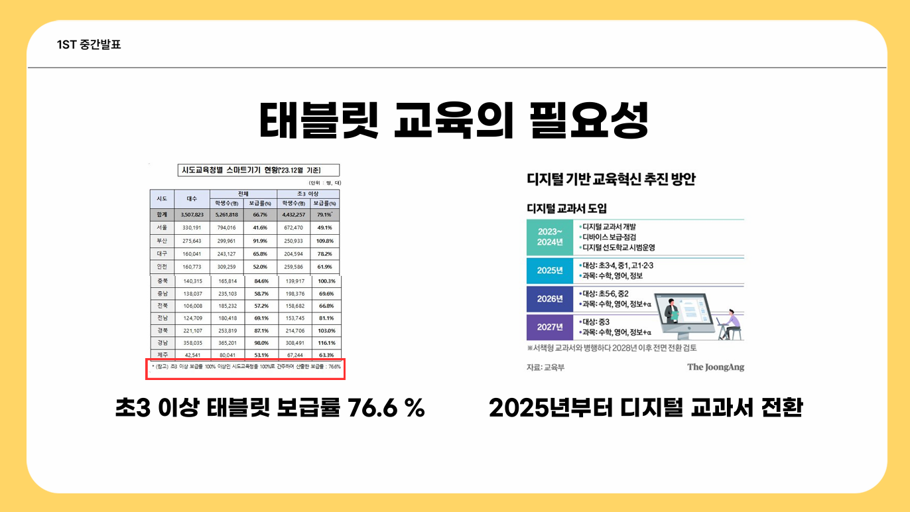

> 서비스 목표
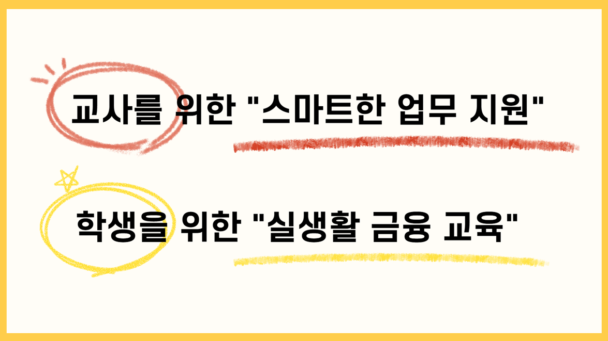

## ✨ 주요 기능
> **학습 효과 & 편의성**을 중점으로 기능을 구현하였습니다.

### 👧 학습 효과
1️⃣ **[소득 명세서] 직업 & 세금에 대한 이해**
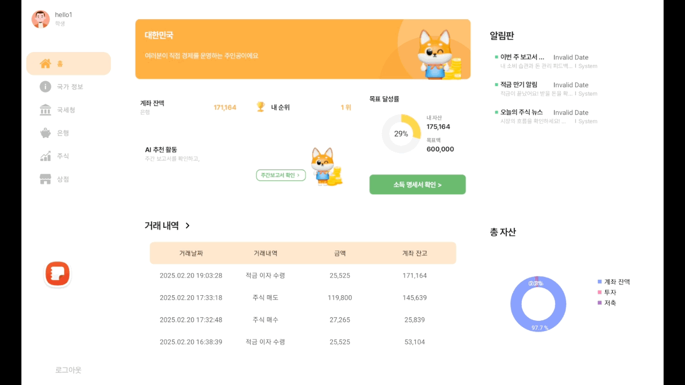

2️⃣ **[아이템 거래] 소비 습관 형성**
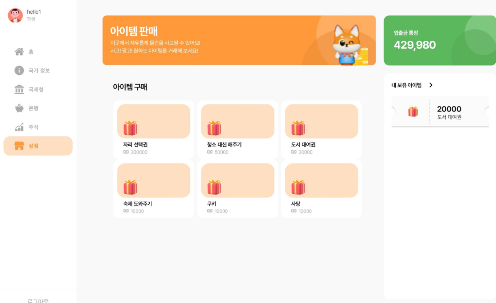

3️⃣ **[주식거래 & 뉴스] 현실감 있는 투자 경험**

4️⃣ **[예금, 적금 상품 가입] 올바른 저축 습관 형성**
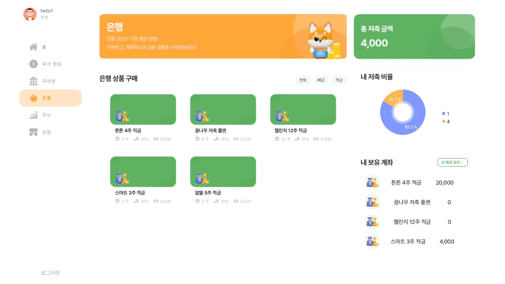

### 👩‍🏫 편의성 
1️⃣ [학생 복수 등록] 등록 절차 간편화
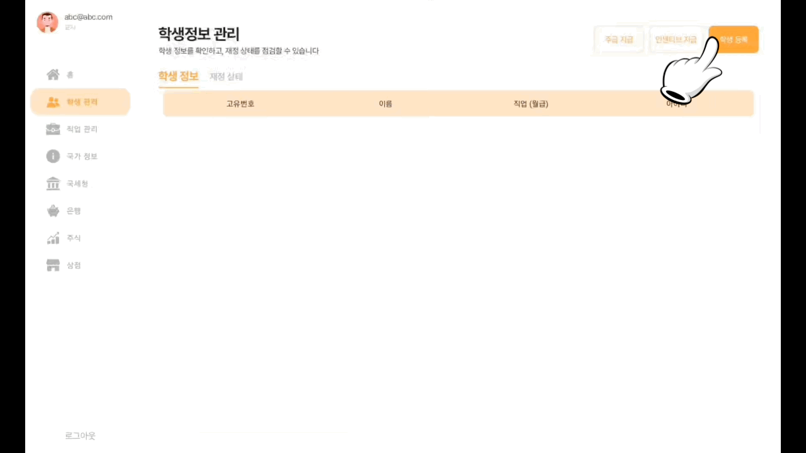

2️⃣ [주간 리포트] 한 눈에 보는 소비 습관
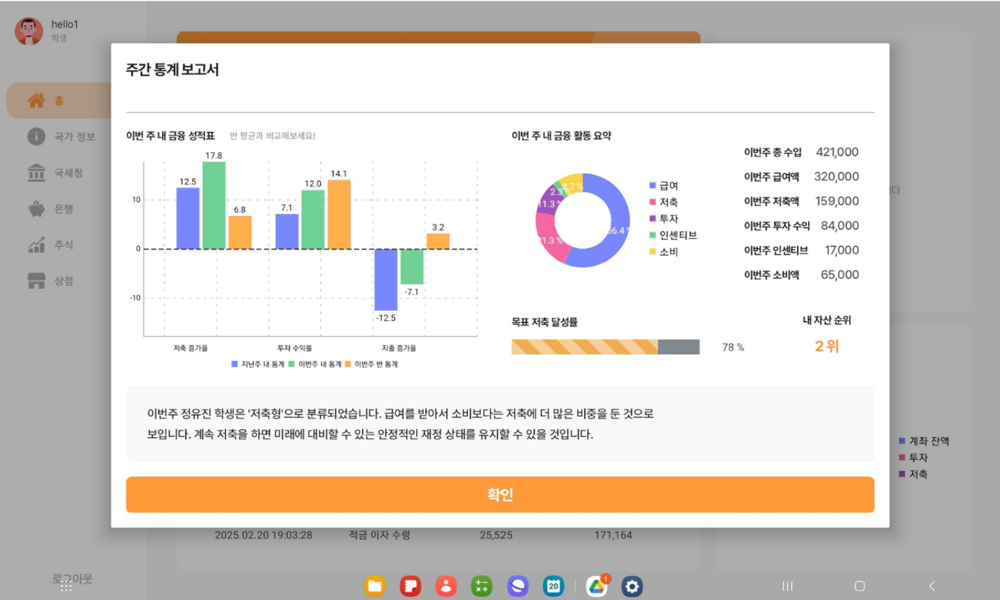
3️⃣ [투표] 적극적 참여로 흥미 유발 
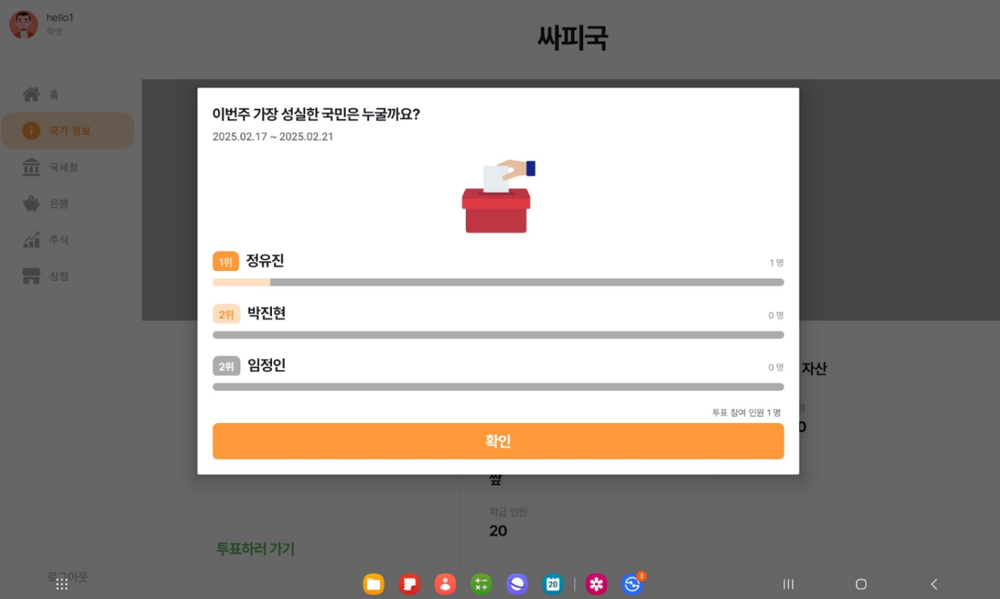

 

 

# 📚 기술 스택

### Backend & Ai

 
  
   
  
  
  
  
  
  
  
  

  
  
  

### FrontEnd

 
  
  
  
  
  
  
  
  
  

### Infra

 
  
  
  
  
  
  

### Project Management & DevOps

 
  
  
  
  
  
 

## 기술적 특징

### ✨ AI 기반 소비 유형 분석 기능
- 학생들의 가상 경제 데이터를 기반으로, AI가 소비 습관을 분석하고 유형(소비형 / 저축형 / 투자형)으로 분류합니다.

> 🚀 분석 흐름 요약  

**1. 데이터 생성**
- 학생별 총소득, 소비, 저축, 투자, 급여, 인센티브 등 가상 데이터 생성

**2. 전처리 및 비율 계산**
- 소비/저축/투자 비율 계산 후 정규화

**3. 비지도 학습 (클러스터링)**
- K-Means를 이용해 소비 유형 분류
- Silhouette Score로 최적 모델 선정

**4. 지도 학습 (분류 모델 학습)**
- 클러스터 결과를 기반으로 Random Forest 분류 모델 학습
- SMOTE 적용으로 데이터 불균형 보정
- 약 98.89% 정확도 달성

**5. 모델 저장 및 재사용**
- 학습된 모델과 정규화 도구는 pickle/joblib으로 저장해 서비스에서 활용 가능

> 📦 주요 라이브러리  
`sklearn`, `imblearn`, `pandas`, `numpy`, `pickle`, `joblib`

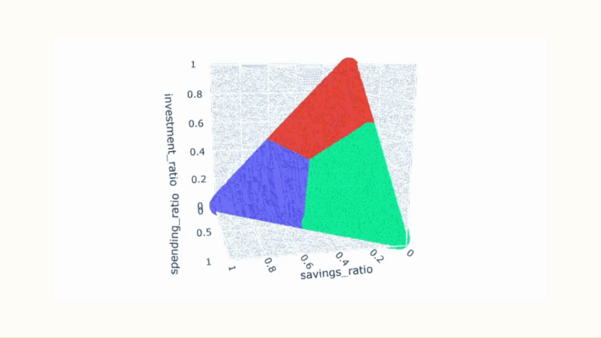

### Open Ai 프롬프팅 전략
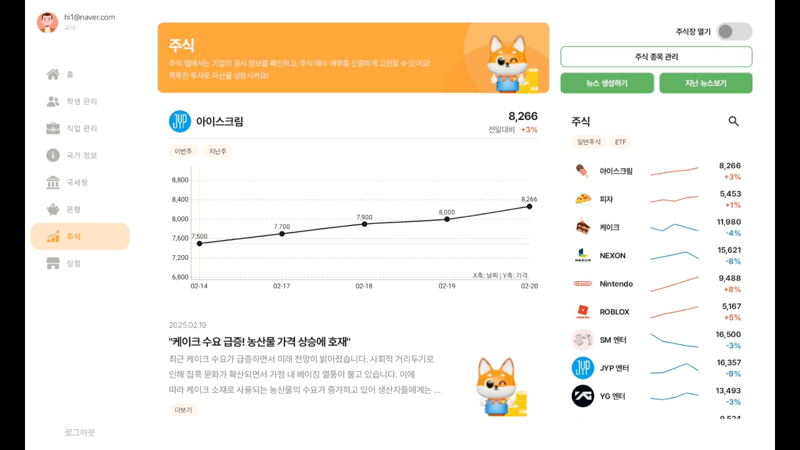

## 서비스 아키텍처

 

# ✨ 프로젝트 진행 및 산출물

## 화면 설계서

## API 명세서

## ERD

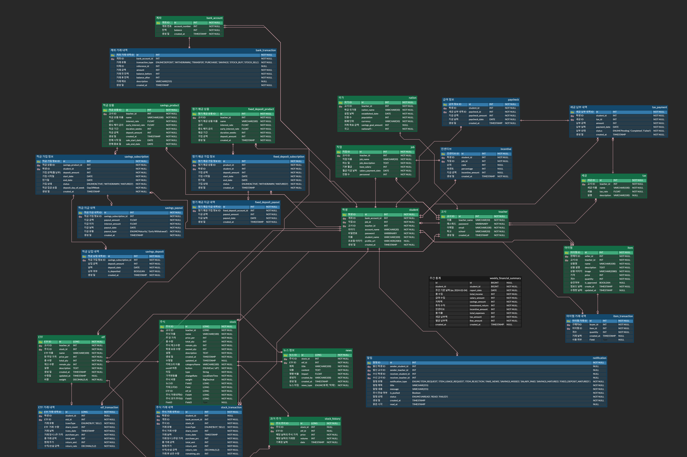

## Git

-   아래는 Sourcetree에서 확인한 브랜치 내역입니다.

 

# 👨‍👩‍👧‍👦 개발 멤버 및 역할분담

|                                                          **[정유진](https://github.com/breadbirds)**                                                          |                                                          **[박진현](https://github.com/iamjinhyeon)**                                                          |                                                           **[서미지](https://github.com/itsanisland)**                                                            |                                                          **[이사랑](https://github.com/frame5562)**                                                           |                                                          **[임정인](https://github.com/harperim)**                                                          |                                                          **[최연지](https://github.com/yeonji3038)**                                                          |
| :-----------------------------------------------------------------------------------------------------------------------------------------------------------: | :-----------------------------------------------------------------------------------------------------------------------------------------------------------: | :-----------------------------------------------------------------------------------------------------------------------------------------------------------: | :-----------------------------------------------------------------------------------------------------------------------------------------------------------: | :-----------------------------------------------------------------------------------------------------------------------------------------------------------: | :-----------------------------------------------------------------------------------------------------------------------------------------------------------: |
|  |  |  |  |  |  |
|                                                                       Leader & Frontend                                                                       |                                                                           Frontend                                                                            |                                                                        Backend & Infra                                                                        |                                                                           Frontend                                                                            |                                                                            Backend                                                                            |                                                                            Backend                                                                            |

 

# 📒 메뉴얼 및 상세 문서

-   [포팅메뉴얼](https://lab.ssafy.com/s12-webmobile4-sub1/S12P11D107/-/wikis/%ED%8F%AC%ED%8C%85-%EB%A9%94%EB%89%B4%EC%96%BC)
-   [Git](https://lab.ssafy.com/s12-webmobile4-sub1/S12P11D107/-/wikis/Git)
-   [화면 설계서](https://www.figma.com/design/16E9xxHkVz0Iray1mDCXxy/%EB%95%A1%EA%B7%B8%EB%9E%91-%F0%9F%92%B0?node-id=629-18478&p=f&t=FvhdWhJP0l99fRVd-0)
-   [ERD](https://www.erdcloud.com/d/feQGbFmFS8WJpQPAg)
-   [API 명세서](https://www.notion.so/1a5e605dad4d813ca426d0b46c18993e?v=1a5e605dad4d81deafdc000c5e0ee43e)
